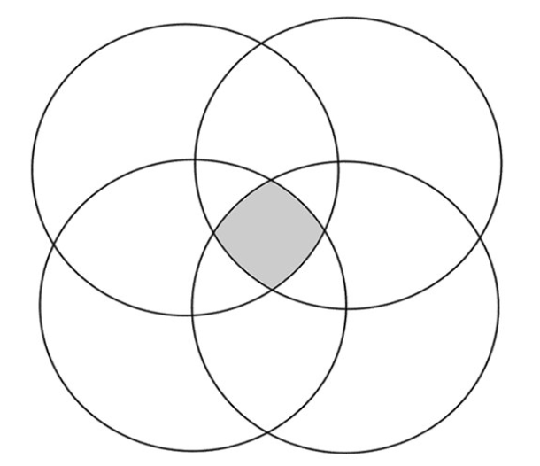

# Task 4.1: Boolean Expressions

Assume the following people working in a team:

| Name    | Age | Favorite Movie |
|---------|-----|----------------|
| Sarah   | 7   | Kung Fu Panda  |
| Peter   | 6   | Super Mario    |
| Vanessa | 7   | Puss in Boots  |
| Amanda  | 6   | Kung Fu Panda  |

1. Put the names of the 4 people in each circle.
   Write down the age of each person in the circles, but if two or more people are the same age, put the age in the
   intersecting parts of their circles.
2. Write a Boolean expression that compares the age of each person in the group using ==, <, >, and &&, for example
   Sarah’s age > Peter's age && Amanda’s age == Vanessa’s age.
3. Then, add the favourite movies into the diagram:
    1. If two or more people have the same favorite movie, put
       the movie in the intersecting parts of their circles.
    2. Write a Boolean expression that compares the favorite movies using `==`, `!=`, and `&&`, for example Sarah’s
       movie == Amanda’s movie && Sarah’s movie != Peter’s movie.
4. Think of 1 more comparison and write it in the circles and as a Boolean expression. Share the Boolean expressions
   with the class.

(This exercise is inspired from this
weblink: https://docs.google.com/document/d/1lpjk0LS_KdAddRurMayJZmaFzeyEg4FyhviZcSTXvtU/edit )

