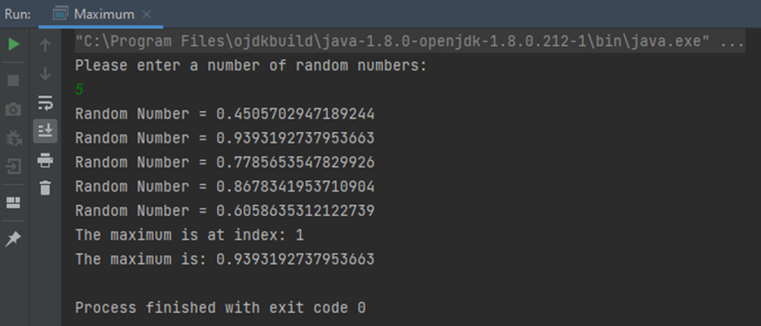

# Task 6.4: Find the maximum

Create a class `Maximum` and add a method `max` to the class, which takes a double array as an argument and returns the
array index at whose position the largest number is located.

Also write a `main` method to test your `max` method. To do so, read from the console how many random numbers should be
generated, and then create a corresponding array of random numbers. Then use the `max` method to find both the index and
the value of the maximum.



Note:

- You need a main() and a max() method
- main():
   - Scanner for reading the array size
   - Create an array of the size entered by the user
   - Populate the array with random values using Math.random(), for example
   - Call max() whereby the array is passed
   - Output the array and the index where the maximum value is located.
- max():
   - Assume that the first array value at index 0 is the maximum and temporarily stores the values
   - Use a for loop, iterate through the array and compare each array position with the temporarily stored value.
   - If you find a higher value, temporarily store this and the `index` in the variables you have declared, and use the
     new maximum value in the next loop iteration.
   - *max() returns the index as return parameter and not the max value!*

You can use this template to fill in the requested tasks:
```java
import java.util.Scanner;
public class Maximum {

    public static void main(String[] args) {

        // 1. Declare and initialise a scanner reference variable
        // with which we can read in user input from the console
      
        // 2. Creation of a double array with length that was input from the user
      
        // 3. Filling the array with random numbers
        
        // 4. Call the max method: max(arrayWithRandomNumbers) and storing its value.
      
        // 5. Create the printouts
    }

    // max() Method: you can use this signature:
    public static int max(double[] inArray) {
        // Your maximum search goes here 
      
    }
}
```